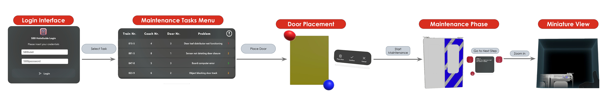
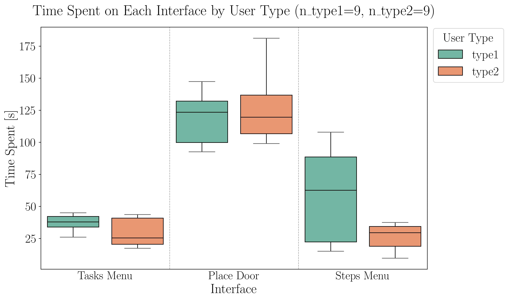
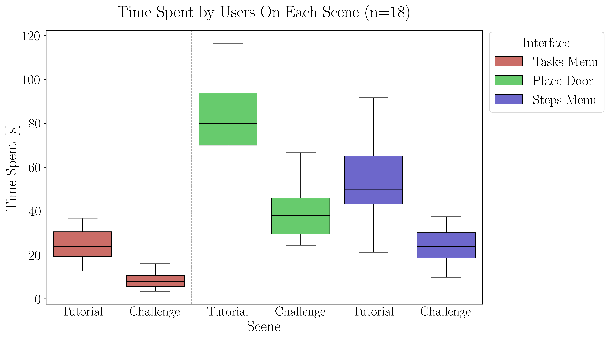
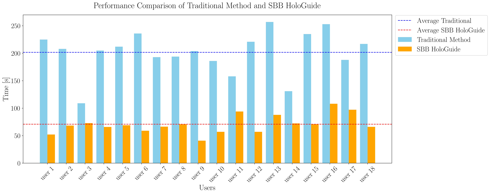

# SBB HoloGuide: Augmented Reality–Driven Train Door Maintenance

## 1. Motivation & Project Description
**Abstract:** : Complex workflows in dynamic industrial environments demand advanced solutions to enhance operator efficiency and support. To address these challenges, we present SBB HoloGuide, an augmented reality (AR) application developed for Swiss Federal Railways (SBB) to simplify train door maintenance. Designed for HoloLens 2, the system overlays virtual information onto physical components, enabling operators—especially novices—to complete tasks efficiently using intuitive interfaces. Key features include precise 3D alignment of virtual-physical components, intuitive visual guidance, and an interactive miniature view for detailed maintenance tasks. The application integrates SBB’s maintenance data from manuals and logs, achieving a 2.85x average speedup in task completion compared to traditional methods, as validated through a user study involving participants with diverse AR experience levels. This work highlights AR’s potential to optimize industrial workflows and lays the groundwork for AR-based maintenance technologies.

You can find the project **paper** [here](README_files/paper.pdf).

You can find the project **teaser video** [here](https://youtu.be/Xzc1fEOiHZ0)

This project is part of the [Mixed Reality](https://cvg.ethz.ch/lectures/Mixed-Reality/) (Fall semester 2024) course at ETH Zürich.

## 2. Project Organization
```
├───Editor
├───Materials <- Materials applied to the objects objects
├───MRTK.Generated
├───Prefabs <- Prefabs we created
│   ├───AnchorPoints <- Prefab for the Door placeholder used by the user to place the door
│   ├───Images <- Images used in the variuos interfaces
│   ├───Menu <- Main menu (task selection menu) prefabs
│   ├───miniature <- Dynamic miniature prefabs
│   ├───PlaceDoor <- StepsMenu prefab
│   ├───PopUp <- Tutorial popup prefabs
│   └───Textures <- Menus Textures
├───Samples
│   └───XR Interaction Toolkit
│       └───3.0.3
│           └───XR Device Simulator
│               ├───Hand Expression Captures
│               ├───Scripts
│               └───UI
│                   ├───ControllerDevice
│                   ├───General
│                   ├───Hands
│                   ├───HeadDevice
│                   └───Mouse
├───Scenes <- Scenes folder, it contains the main scene of the application
├───Scripts
│   ├───DoorScene <- Scripts relative to object menagement
│   ├───LoginScene <- Scripts to handle user login at application startup
│   ├───MenuScene <- Main menu scripts
│   ├───PlacementScene <- Scripts used during the door placement
│   └───Utils <- Utilities
├───Settings
├───TextMesh Pro
│   ├───Documentation
│   ├───Examples & Extras
│   │   ├───Fonts
│   │   ├───Materials
│   │   ├───Prefabs
│   │   ├───Resources
│   │   │   ├───Color Gradient Presets
│   │   │   ├───Fonts & Materials
│   │   │   └───Sprite Assets
│   │   ├───Scenes
│   │   ├───Scripts
│   │   ├───Sprites
│   │   └───Textures
│   ├───Fonts
│   ├───Resources
│   │   ├───Fonts & Materials
│   │   ├───Sprite Assets
│   │   └───Style Sheets
│   ├───Shaders
│   └───Sprites
├───TutorialInfo <- Tutorial related Scripts
│   ├───Icons
│   └───Scripts
│       └───Editor
├───UI Toolkit
│   └───UnityThemes
├───XR
│   ├───Loaders
│   ├───Resources
│   ├───Settings
│   └───UserSimulationSettings
│       └───Resources
└───XRI
    └───Settings
        └───Resources
```
## 3. :wrench: Project Setup
The following setup guide explains the installation and deployment process for [HoloLens 2](https://learn.microsoft.com/en-us/hololens/).

The project is set up for Unity 2022.3 LTS (more recent versions may work as well). 

1. Download and install the latest Unity Hub and create a free Unity account in case you don’t have one.

2. When opening the Unity Hub for the first time, click on Skip Installation. Then, click on Install Editor and select the latest version of Unity 2022.3 LTS. 

3. Make sure to select the Universal Windows Platform Build Support and the Windows Build Support (IL2CPP) modules.


If you don’t have [Visual Studio](https://visualstudio.microsoft.com/) installed you can select the tick box in the developer section. This will automatically start the installation process for Visual Studio 2022. When installing Visual Studio, make sure you install the required components listed in the next step. The community version of Visual Studio is sufficient. 

In the Workloads tab, make sure to install the following workloads:
- Game development with Unity
- .NET desktop development
- Desktop development with C++
- Windows application development. 

  In the Installation Details tab, also select the following components:
  - Universal Windows Platform tools
  - C++ (v143) Universal Windows Platform tools


This software also require the following dependencies to integrate the development environment with MRTK 3 Features (these features can be intalled using the [Mixed Reality Feature Tool](https://learn.microsoft.com/en-us/windows/mixed-reality/develop/unity/welcome-to-mr-feature-tool)):
- MRTK3 (all components)
- Platform Support &rarr; Mixed Reality OpenXR Plugin

> :warning: **Storage Space Requirements**
>
> The complete installation of Unity and Visual Studio, including all components, requires
> approximately 60 GB of disk space. Additionally, builds will consume more storage.
> It is recommended to have at least 100 GB of free storage available.

## 4. Application flow
The following diagram illustrates the core application flow
<br><br>

<br><br>
The application flow is divided into six parts:  
- When the application starts, the user is prompted to log in.  
- An intuitive menu displays all the tasks the user needs to complete.  
- To begin the maintenance process, the user aligns a placeholder with the actual door.  
- The user then performs the maintenance by following the provided instructions step by step.  
- Throughout the process, the user can utilize the miniature view for a clearer visualization of the components.

## 5. Main Results
In the following section we will refer to 2 different types of users: 
- Type 1: Users with no prior experience, either in AR or in industrial maintenance.
- Type 2: Users with AR experience but no industrial maintenance experience.

The following Plots illustrate the main results we obtained through a comprehensive user test.

<br><br>

<br><br>
- In the above plot we evaluate the usability of the application’s interfaces by comparing the time spent by **type 1** and **type 2** users. The above plot shows that for the **Tasks Menu** and **Place Door** interfaces, the median times for both user types are closely aligned, and the inter-quartile ranges show substantial overlap, indicating that these interfaces are equally user-friendly for novices and experienced users alike. However, in the **Steps Menu** interface, **type 1 users** exhibit longer completion times and greater variability compared to **type 2 users**. We believe this discrepancy arises because progressing through the Steps Menu requires users to perform a hand gesture, using the palm of the hand, to access the 3D miniature for visualizing small and intricate components. For users with no prior AR experience, mastering this gesture was less intuitive and smooth compared to those with AR experience. Despite this, the discrepancy is not that significant, and **overall, across all three interfaces, we can conclude that the application is user-friendly for users with no prior AR experience**.

<br><br>

<br><br>
- In the above plot we evaluate whether the tutorial provided in the application effectively helped users understand the AR mechanisms and improved their performance in the subsequent challenge phase, where they carried out maintenance tasks. The above plot demonstrates the **tutorial’s impact, showing a consistent reduction in time spent across all three application interfaces: Tasks Menu, Place Door, and Steps Menu**. For each interface, the median time during the challenge phase is significantly lower than in the tutorial, indicating that users learned to perform the same tasks more efficiently. Furthermore, the narrower inter-quartile range and whiskers in the challenge phase reflect **reduced variability and greater consistency among users**. The Place Door interface shows the most pronounced improvement, with a substantial reduction in median time and a narrower spread, suggesting that this initially challenging task was mastered through the tutorial.

<br><br>

<br><br>
- In the above plot we evaluate the performance of SBB HoloGuide against the traditional mainte nance method using task completion time as the Key Performance Indicator (KPI). The above chart illustrates individual user times for both methods, with average times represented by dashed lines. The results clearly demonstrate that **SBB HoloGuide consistently outperforms the use of the manual across all users**.
**For all users, the time required to complete the maintenance task with the AR application is significantly lower than with the traditional method. The average time for the traditional method is <b>201.78</b> seconds, compared to <b>70.92</b> seconds for SBB HoloGuide, achieving a <b>2.85x</b> speedup on average**. This substantial reduction in task completion time empirically supports the conclusion that the AR application offers a faster, more efficient, and streamlined alternative for train door maintenance.
<br><br>

| **Measure**                  | **Mean** | **STD** |
|------------------------------|----------|---------|
| Perceived Frustration [1-5]  | 2        | 0.82    |
| Perceived Fatigue [1-5]      | 2.38     | 0.87    |
| Navigation [1-5]                   | 4.85     | 0.38    |
| Usability [1-5]                    | 4.62     | 0.51    |
| Appearance [1-5]                   | 4.70     | 0.48    |
| Content Quality [1-5]              | 4.62     | 0.65    |


- We summarize some key findings from the user study form completed by participants in the above table.
Nearly 90% of users reported no increased frustration or mental fatigue after using the AR application, and 100% found the tutorial helpful in understanding the AR mechanisms. The Steps Menu and Tasks Menu were the most appreciated interfaces, favored by 61.5% and 30.8%of users, respectively, while the Place Door received the lowest preference, with 84.6% ranking it the least favorable. The application received an average rating **above 4.5 across all the interface operability categories, i.e. navigation, usability, appearance, and content quality**. Furthermore, all users preferred the AR application over the traditional manual for performing the maintenance task.

# Contact

- [Riccardo Bollati](mailto:rbollati@ethz.ch)
- [Federica Bruni](mailto:fbruni@ethz.ch)
- [Luca Tagliavini](mailto:ltagliavini@ethz.ch)
- [Christopher Zanoli](mailto:czanoli@ethz.ch)

**Citation:**

```
@misc{bollati_bruni_tagliavini_zanoli_MR2024, 
  title={SBB HoloGuide: Augmented Reality–Driven Train Door Maintenance},
  url={https://github.com/lucat1/mixed-reality},
  journal={ETHZ - Mixed Reality Fall Semester 2024},
  author={Bollati, Riccardo and Bruni, Federica and Tagliavini, Luca and Zanoli, Christopher},
  year={2024}, 
  month={Jan}
} 
```
