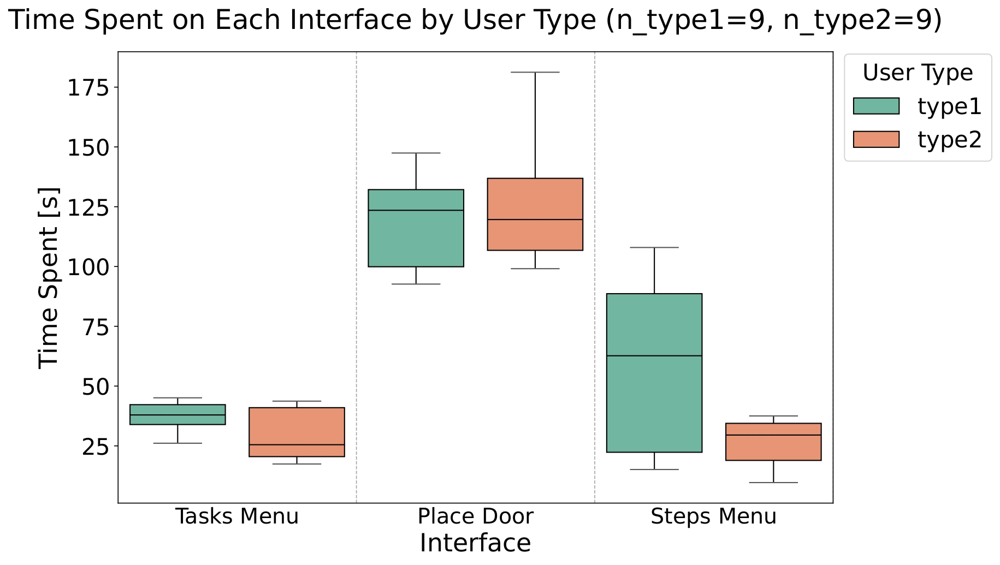
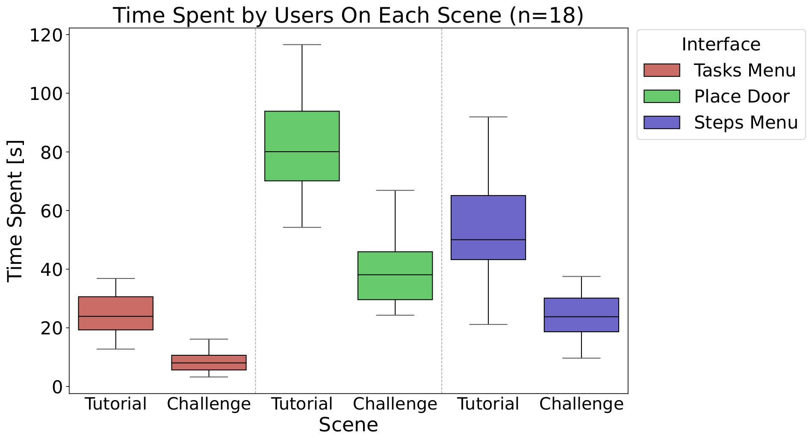

# Mixed Reality 2024
## SBBHologuide
- Authors: Riccardo Bollati, Federica Bruni, Luca Tagliavini, Christopher Zanoli

## 1. Project Description
Dynamic railway maintenance demands adaptability and expertise, yet current systems lack clear guidance. SBB HoloGuide bridges this gap with AR-powered train door maintenance. 

You can find the project report [here](README_files/report.pdf)

## 2. Project Organization
```
├───Editor
├───Materials <- Materials applied to the objects objects
├───MRTK.Generated
├───Prefabs <- Prefabs we created
│   ├───AnchorPoints <- Prefab for the Door placeholder used by the user to place the door
│   ├───Images <- Images used in the variuos interfaces
│   ├───Menu <- Main menu (task selection menu) prefabs
│   ├───miniature <- Dynamic miniature prefabs
│   ├───PlaceDoor <- StepsMenu prefab
│   ├───PopUp <- Tutorial popup prefabs
│   └───Textures <- Menus Textures
├───Samples
│   └───XR Interaction Toolkit
│       └───3.0.3
│           └───XR Device Simulator
│               ├───Hand Expression Captures
│               ├───Scripts
│               └───UI
│                   ├───ControllerDevice
│                   ├───General
│                   ├───Hands
│                   ├───HeadDevice
│                   └───Mouse
├───Scenes <- Scenes folder, it contains the main scene of the application
├───Scripts
│   ├───DoorScene <- Scripts relative to object menagement
│   ├───LoginScene <- Scripts to handle user login at application startup
│   ├───MenuScene <- Main menu scripts
│   ├───PlacementScene <- Scripts used during the door placement
│   └───Utils <- Utilities
├───Settings
├───TextMesh Pro
│   ├───Documentation
│   ├───Examples & Extras
│   │   ├───Fonts
│   │   ├───Materials
│   │   ├───Prefabs
│   │   ├───Resources
│   │   │   ├───Color Gradient Presets
│   │   │   ├───Fonts & Materials
│   │   │   └───Sprite Assets
│   │   ├───Scenes
│   │   ├───Scripts
│   │   ├───Sprites
│   │   └───Textures
│   ├───Fonts
│   ├───Resources
│   │   ├───Fonts & Materials
│   │   ├───Sprite Assets
│   │   └───Style Sheets
│   ├───Shaders
│   └───Sprites
├───TutorialInfo <- Tutorial related Scripts
│   ├───Icons
│   └───Scripts
│       └───Editor
├───UI Toolkit
│   └───UnityThemes
├───XR
│   ├───Loaders
│   ├───Resources
│   ├───Settings
│   └───UserSimulationSettings
│       └───Resources
└───XRI
    └───Settings
        └───Resources
```
## 3. Project Setup
This software requires Unity, version starting from 2022.3 on. This software also require all the following dependencies to integrate the development environment with MRTK 3 Features (these features can be intalled using "MixedRealityFeatureTool"):
- MRTK3
- Platform Support

## 4. Application flow
The following diagram illustrates how the application works
<br><br>

<br><br>
the application experience consists of 6 parts:
- once the application is started the user is asked to login.
- in an easy to use menu the user is presented with all the tasks he has to perform
- to start the maintenance process the user overlays a placeholder with the real door
- the user can then carry out the maintenance by going through all the instructions
- during the all process the user can also take advantage of the miniature view to better visualize the components

## 5. Results
In the following section we will refer to 2 different types of users: 
- Type 1: Users with no prior experience, either in AR or in industrial maintenance.
- Type 2: Users with AR experience but no industrial maintenance experience.
- Type 3: Users with experience in both AR and industrial maintenance.

The following Plots illustrate the results we obtained thanks to the user tests
<br><br>

<br><br>
We evaluate the usability of the application’s interfaces by comparing the time spent by type 1 and type 2 users. The above plot shows that for the Tasks Menu and Place Door interfaces, the median times for both user types are closely aligned, and the inter-quartile ranges show substantial overlap, indicating that these interfaces are equally userfriendly for novices and experienced users alike. However, in the Steps Menu interface, type 1 users exhibit longer completion times and greater variability compared to type 2 users. We believe this discrepancy arises because progressing through the Steps Menu requires users to perform a hand gesture, using the palm of the hand, to access the 3D miniature for visualizing small and intricate components. For users with no prior AR experience, mastering this gesture was less intuitive and smooth
compared to those with AR experience. Despite this, the discrepancy is not that significant, and overall, across all three interfaces, we can conclude that the application is user-friendly for users with no prior AR experience.
<br><br>

<br><br>
We evaluate whether the tutorial provided in the application effectively helped users understand the AR mechanisms and improved their performance in the subsequent challenge phase, where they carried out maintenance tasks. The above plot demonstrates the tutorial’s impact, showing a consistent reduction in time spent across all three application interfaces: Tasks Menu, Place Door, and Steps Menu.
<br><br>

<br><br>
We evaluate the performance of SBB HoloGuide against the traditional mainte nance method using task completion time as the KPI. The above chart illustrates individual user times for both methods, with average times represented by dashed lines. The results clearly demonstrate that SBB HoloGuide consistently outperforms the use of the manual.
For all users, the time required to complete the maintenance task with the AR application is significantly lower than with the traditional method. The average time for the traditional method is <b>201.78</b> seconds, compared to <b>70.92</b> seconds for SBB HoloGuide, achieving a <b>2.85x</b> speedup on average. This substantial reduction in task completion time empirically supports the conclusion that the AR application offers a faster, more efficient, and streamlined alternative for train door maintenance.
## 6. Conclusions
In this work, we introduced SBB HoloGuide, an innovative AR application designed for intuitive and efficient maintenance of SBB train doors.
<br></br>
Our user study shows that users with no AR experience perform maintenance tasks as quickly as those with AR expertise, demonstrating the application’s user-friendliness. Furthermore, the study revealed that the AR application achieves a remarkable 2.85x reduction in task completion time compared to traditional manual methods.
<br></br>
Future work could focus on optimizing the Place Door interface, identified as a bottleneck in both design and performance. Implementing an automatic door placement mechanism using 6D-pose estimation could further enhance efficiency by eliminating the need for manual placement. Additionally, integrating an Extract, Transform, and Load (ETL) layer could automate and streamline the organization of SBB's extensive and heterogeneous maintenance data, improving usability and expanding the application's potential capabilities.
